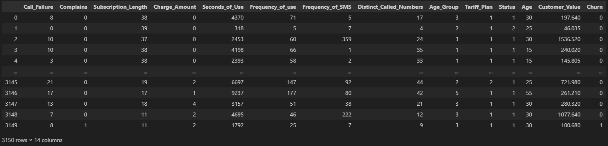

# Corporate Forecasting using Traditional AI and Generative AI

This is my first project about **Artificial Intelligence** in CRM context. Moreover, this is also a part of my Bachelor's Degree final thesis on "*Corporate Forecasting using Shallow and Generative Learning Models: A CRM Department Use Case*", a thesis in which I analyze a dataset from an Iranian telecommunication company where combining forecasting models using **machine Learning techniques** and purposing an approach with Generative AI using Llama 3.1B to create a Conversational Assistant for a CRM Analyst.

## Structure of the Project
There are two script files in **Python**, one for analysis done via [Traditional AI models](Trad-AI.ipynb) and the other for construction and analysis via [Generative AI](Chatbot-test.py).

In the first analysis, I analyzed 
